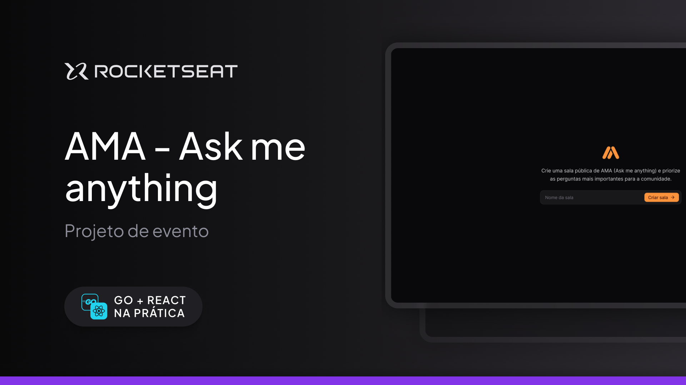

<div align="center">
    
</div>

<p align="center">
  AMA - Ask me anything, é um um website para utilização de WebSockets através de uma sala com perguntas e reações
</p>

---
## :art: Layout
[Figma](https://www.figma.com/community/file/1402302237126862071)


---
## 💻 Techs
<div style='text-align: center;'>

**ReactJS**
**Tailwind**
**WebSockets**
**GO**
**React Query**
**SwiperJS**

</div>

---


## 🛠️ Instalação
1. **Clone o repositório:**
   ```bash
   git clone https://github.com/lucasgomesgp/goreact-nlw.git
   ```

---

## 🚀 Uso

1. Abra o diretório backend

```bash
  cd backend
```

2. Coloque o container para rodar

```bash
  docker compose up
```

```bash
  docker compose start
```

3. Rode o backend
```bash
  go run cmd/wsrs/main.go
```

4. Em outra aba, vá ao diretório web
```bash
  cd frontend
```
5. Rode o projeto
```bash
  npm run dev
```